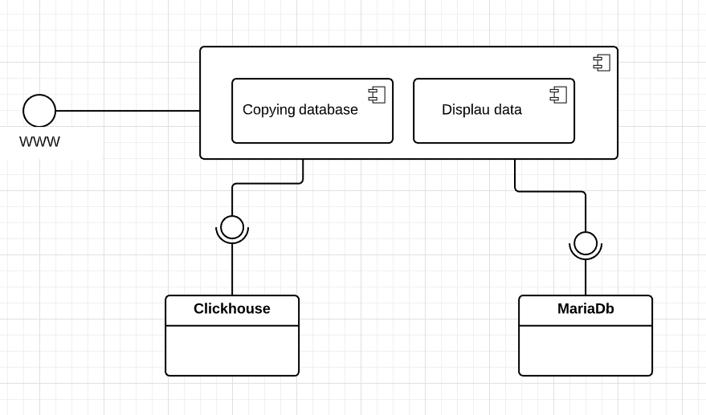

# MySQL to ClickHouse Bridge

### Aplikacja umożliwiająca kopiowanie danych pomiędzy bazami MariaDB i ClickHouse.

### Autorzy
- Filip Rebizant
- Konrad Rejman
- Mateusz Matyaszek
- Bartłomiej Kudełka

## Spis treści
* [Opis aplikacji](#Opis-aplikacji)
* [Instalacja i uruchmienie aplikacji](#Instalacja)
* [Schematy UML](#schematy-uml)
* [Wykorzystane technologie](#wykorzystane-technologie)

### Opis aplikacji
Celem aplikacji jest tworzenie kopii danych pomiędzy systemami bazodanowymi MariaDB i ClickHouse. Aplikacja przetwarza dane o sporych rozmiarach, typu big-data.

### Instalacja
    docker-compose build
#### Uruchomienie aplikacji
    docker-compose up -d
    
##### Aplikacja powinna być dostępna pod adresem http://localhost:8080

#### Wejście do kontenera
    docker-compose exec <nazwa kontenera> bash
    np docker-compose exec php-fpm bash
    
#### Wgranie bazy danych:
    docker-compose exec mariadb bash
    mysql -u ips2019 -p ips2019 < dbdump/createDatabase.sql
    lub mysql -u ips2019 -p ips2019 < dbdump/one_million_database.sql
    haslo: ips2019
  
### Schematy UML
- Diagram komponentów

### Wykorzystane technologie
- MariaDB
- ClickHouse
- Symfony
- Doctrine DBAL ClickHouse Driver
- NginX

### Terminarz
  - opracowanie założeń i wymagań do: 28.10.2019
  - opcowanie wstępnej dokumentacji do: 04.11.2019
  - implementacja do: 25.11.2019
  - testy do: 02.12.2019
  - przygotowanie dokumentacji do: 09.12.2019
  - prezentacja projektu, rozliczenie, zaliczenia: 16.12.2019 
